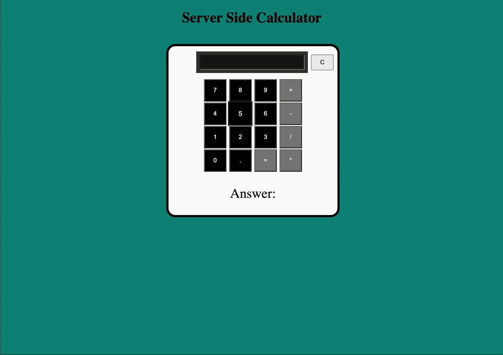

  

# SERVER SIDE CALCULATOR

## Description

_Duration: 4 Hours_

This application is a full functional server sided calculator. It is built with an HTML, CSS, jQuery, AJAX and Javascript front end. Powered by a Node.js and Express.js backend. With this calculator you are able to do math on two numbers. It can currently add, subtract, divide, and multiply. The math is all done on the server side and then sent back to the client to display on the DOM

## Screen Shot

### Prerequisites

Node Express

## How does someone use this application?

1. Install node and go to the terminal and type NPM init --yes
2. Install express in the terminal. NPM install express
3. Calculate by adding a number, a operator, and then another number

## Built With

HTML CSS Javascript jQuery, AJAX, Node.js, Express.js

## Acknowledgement

Thanks to [Prime Digital Academy](www.primeacademy.io) who equipped and helped me to make this application a reality. Thank you to my instructor Liz when helped answer any questions I may have had while building this!

## Support

If you have suggestions or issues, please email me at [buckhananstephon@gmail.com](https://www.google.com)
